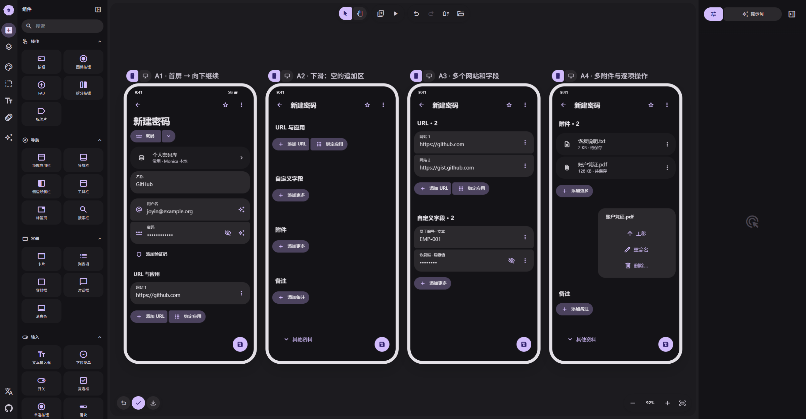

# 01 · 分区追加，多项编辑

[在 M3E Canvas 编辑](https://lnkiai.github.io/m3e-canvas/#docz=1Vzrb9NYFv9Xonxuwddv99Muq92Z1QzSarW7X1aochqHeknjyHH62BFSOwuUR58wFCiFoWyBLo-27AItTQFp_hQmTtJP_At7r6-d2I6b-l6HtJUQIsE-_p1zf-dxzz3OD2lLt_JaeiDNgNQv2yn76hV7Zrfx6YN9_dGXvRl7bXl_9X19b6nxcTHdl86YupaD1541CvqQmqotbdmV3f3Vt6m_sejmxsbHxsZqff0TvLO28tzeeFif2_qyd99-dae28fbXyan69Xe1yanqzlx1d626e7PxbKq29L62erW2NF1b_fevkz_CZ-RMdQThKQ4bBQ1-LuZVK2eYI_ArtZA1DT2LvlTzmmVp32kT6MqyWcyjS61hDd36QzqrmhfSA5ZZ1iBmwxo-a2S1kvfFkFGwTLVkwTtLFhSpmkhiaVgtoseaRrmQ1dA3OXgdumaiZGkj8POIYelGAX6jjRdNrVTSR7X0RRcvFP73H9IQ2kA6x8BrC1iH3zo23X-6ZL-eT32-cjNlLyxWd27UK8_qlVfwsvH0ANOXnnD-zpxHDyubOXUI6VIwLCTBXpip7kzWKsv29fXG6ro9extaqf5hsf7inr3939rKtfrLl_ACuEjQ5vXKJXvrY_XTg_rte7XtClzC1F___H3qdKpeWbQ3lu3dn-o_rddmru3f3ICXooVZmNt_8Lg296QxDVdrufr-Gl4q--bM_r1L1co7KHT_wUP78rr9ejIFLWkZI6nSsKZZaK0u9nkqA5_KDhOgkrXK4pe95fp_duvLlzCfILGwzrx4mNaVd9BAKWg-eDNWHrIMQoV4qjuztbub9t57-_WPEEVtc7668xyKtn_-GV3sqF27_wYy155_Xrs1W_2w0th8gi9AvHQugIpjO1Qrs9BY9sp6beUFtF1QLdanFud4x9oyfJhr_psz2FhYJ4U9RCd8V_3-G2huiAAaprE6A9cgZHoMC6k3vWtvzdsPb9RfV-DfjfkVuPgQN0J_-Qlcc3g7hGsvXIL_qN94WX9xA6uNr0TOe_XR_r01fCW0mv3htX1r1r78rlpZwvf6VOV8qvKuqpgC0Fv3JxcgwbAtsbaAkw9RF9-MpExeq11d2p-etddmsfEdaHcQm3dv7_9rHQKEVrHnNzFLkE5b81gJ-DzI2OrunP3hln1tFoYJh5P3XSXeXqot3YOr7DJ-ZbIp0NPvXF_6PPToos8_GdBfVEulMcPM9ufyxlg_wCqxvKMQYPvS6rgOb4Cf-tI69P3Dbr6gF9D_Wdq4BT-NqqauOpHDMgpqHskYQmGjUM7n-9J5NaPl4f8pAzy6taT_U8PPzBj5LI5QF881l6XtcSzGyrEiDViWEqzwTSr1eWkrAm9OzZc6AuZcvrAOXk4kwsu18CJYZ8ow_hTSLVxNuGnVNI2xwYw6dKEJkpcD6iF9OwHlXcui28iR8rGRjhimNjiqmRYtUMGlqyLSABViA4W50RzMwBs1kxaq6ELFoULhiZCKlGTFRYm9eaX-aKoJnGPiehhgA4wFCpl9gc_H8nrJ-iOuHQ6CDisVS82oJc23BDDDVHddBezdW0iHcrFomJZeQJHW3tmBMRGFaK8KW3lpr2y5Ill4xdCwNmoahUFTPz_cohknw8XL6fl8K1r_DlY4ql7QzO-NMff-P-ALCqj26mimoGOzEqGZfK6dMcYPXVyfCuifUEuJPVCbb6He8H5Tzerl0l-MIo7t-OMZp4bB30A7DV3QvCjm84GOiruBgsVxgpUJFecpaW0vzNafUYVgIAQQc4xMhligRPyNbn1bzrQQi_ERi6GsQRY5gHjE5JJpuSVhvUVcinASod4S5UqhXcHVbcgwKnrJQdCkAVOmBP0PY0Iv_EYbV0fg5u-UYZ6nYpriMs1NpqRhTIlfoeQtzSyoljaojah6njalskyoTiFE7NwfE3HZMgbVMa1kjGjUcEHAk3meIUMLeurJcteyBMsGnIIXCPWmrdRDZQ-BG7NcELFEuLXgKBF_nnx86B8az2b5gGfzAqE-8St670ZqHxGCLk0MNX5N3xWXdpMzx_B0cMXYcEf1kp7R87o1MWjkctSA5cA2RGQIfZE2QaHWW3VnDnfdIih86F7fy004doqEOz3Wl5tOVonNMYGCVeQJuwYM5YLhDl0qqi9zeJ8DBDGLZEU2R9tHGrasYmng9OnzujVczpwaMkZogiXn9ZV4z-SE8NnYPp24_8EpHlYcf2RAViVz8Wu2kjp6UJhEfgF53bGj5NKYl6k6izwtjSlbi7zLYCfzU3TAQGyzdqFZ526UJIGqCcZL8SmQvAvGu_lHZuhai3LvfItXPMoyLmUJOatQcvaAXCnHJa8gBoGzMlkAE2i7jaHTGxrochA6L5DFM4G2PsEnNBSIRSaIWGTJKiqRNrLZa9O1_9HQQ2SDsU0i7UX78lsm7H_-w6iWL2rjRbWQHUQu6cvIPFn_nPMiB12qE-MfoCRLdaK72VJ4qlQn0jZFKVOd6O64FI4q1YkEG67EqU5qdlAAVa6T4uflLuQ6qXl6IlIlO6mHhaTEeaR1kx1hY1yibXmgZPfLdoqlCGQSH2QuINwbST5PO1GtcclzWXeHAgRCxWlPMZJsCiUxBFoiZBhtVdKdXaEkhZwZCIT449fZyb1ZDnoGS1i6SnJPPaN7rWZJCZKM5QgVp63ZXc9gaTxDZkKgCYtembaEbHlGyTqVzD1kEHIPliNUIn5qTuwesucebrLjAVn8lGl3GaENEm3ik5Wge5PukuSj7obSJj4l5Ck84WG4Qr3ZWrxrbz-p7y3Z89to1dCM7spLGmdXQEgFwpkJhbY5-vuzf-pnGEDj3Eq4kOVFQtA9rGQVLugcAke2IVd6O43Tvdyn8EFmCYTnywrtxrM29dhem60_mnLmu5cXGnfm7ck9KucIFbaCSJa-FdrCtpuHrYoY8haBJ9Qi_qFgcm9plrXuyC8x2PhlbXdOMJXmSaBI1whSenXmARg3XQGeoZunZnp87AEYr4zjFKpuEBbQq3YQYDz2ihJVPwgL6FlDCDBu4Qkkb_6QFG8Pzz8AozTp6zaFAFlGwRLo2_G09THEGaIxIJzLwBJIRpe10pCpF52XosKZsbH5pnZ37pTl6B8YX2ZT351x3i_5eLn66YH96m66Nbjcvn5dHloGYV9nWcJhWADIjKRaljo0PAhV8I94N948RQOX068am1Onitlc2EiAlY_UTN5wt-D5LOlQJ918N4so61aULHrF5UgGvL0JbyAI7l6TMNsC6iHvKF7gQCDEDwSCB9_b6hMOHwL_xHfbaVd153r9WSWc0srFMdU3AedUViRxtznx7YEWGNLoJXYAjd4-W_yAB5y987msbiXAK4XxEvYjgH9Yu_1I0Xlz7_PkU3-0zWuWNmiUrbxe0BIg9_Kxl-FEwg0HoJ7Ypj6-BWw4uZEe4AL_3HMPT3BBcwBaYulKd8ASHOAlqt1zoH9YU2Gt1z8q9OO3wh3oTjdhAgskAB4pLkibA17ZipUqQFzy5NhotRSFTq0ocUehFhetFnDCPYVeUfKOQi_Gh8N5Yv-QMVJUh6z-jJGd8DbC7uknWeg6XHagZPE5WBwdAQqobvWCsoJXvGjwyqxqTjTLl1DpwrSVLgz6kQITXllCP2Zg5fFXlgmDNTSj-zGDPl6kNKWD3j8V3UVTurIPCVmhINphmp6h1BE_DL_UwFBtiWIIj_YQIt9ACSGxb1imqufR5gH7B-C7vaq-ByRxEjQgFNNHQi4gYg9wqI8_ZpyPtC6A07tnL7Hb9mqKp_SDqOqjsytw4sGRUiLc57bLShQZ2WMWGX3qtUXCBKZKFvnUbNyg53tke5CTOGr8nYNa6xdluh7YODmKupxItyBtwo4rd6lCmk-9FneBO3iZwFYJyVssluKyV45iL3DfkiCmb7u0aPr6fwOp6wRmpYMDisASvrjVJotyTUrDupaPG1N8T22PKQLpu2ftwjrFlP3nM43Nqa9RMQlcRGDxpsAB4Uta7cKOa2ChSoo-9Vocbr4JQm-rXmVF3yN9DBa8DQ7h7GWEtJ6nRUGIYK_g_vAP8Yq0CTuu7KVKiz71WuwVvUNoelv1LC36nukPwN4bFaT0bZd2BGlRkDqEX45wXLJd2DEhcEwLtAfVBBboWVCNLAu8oOq8g0unQJygin_PsPusVDqwUiD8eYB2YSeBlUoHViawQM9YqXRipUA4sxEh7QhYKYIOrBQJp0_bhZ0AVvpAt7MygQV6xUrfIyNYKRL-UlOEtE6sbB6udpeVclQJ2nxvknC4r13YMWFldzZQclQJ6r1wkcBWveKvHFmBKl6xQvhCVYS0nm-g5Kj6EzDer0aQLslxLUC7s4OSo0pVwHi_60dvrJ5toeTIYhUAdxdIzOC41epX3UMpUb1xLwKT_vRCu7BjQuGYFmiPqwks0Ku4qkQ2vL24KpK-rBO34f1Vq1UA2MgjG2-GnnBVIsSdAGL6UfvPYhgmsRF6xU3_M_0xk_fKFkJ2Rsk7EnpG7fFb44MM6bTmSdzl-1FH0DOJEXpHz8idfpOeEvFoNtleP9mu6tzF_wM)

[JSON 备份](01-password-flow.json)

- **A1 · 首屏 → 向下继续**：同一滚动表单。网站已有第一项，组尾保留添加 URL / 绑定应用按钮组；后面接自定义字段和附件，非全局 bottom sheet。
- **A2 · 下滑：空的追加区**：延续 A1 的滚动页面，不是弹层。每个区域的添加更多只操作该区域，添加后按钮仍留在末尾。
- **A3 · 多个网站和字段**：网站直接加空行；自定义字段按钮弹出小型类型菜单后加入一行。各行独立更多菜单，删除一行不影响其他行。
- **A4 · 多附件与逐项操作**：附件多选或重复添加，列表底部一直可追加。小菜单作用于当前文件；其他资料只保留最底部一行。

