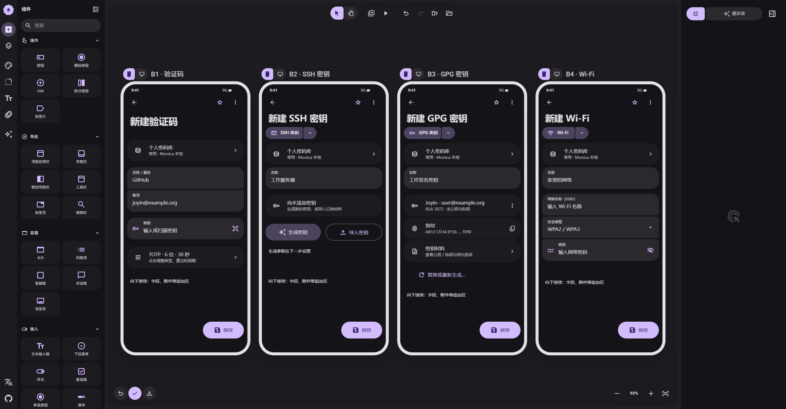

# 02 · 验证码与密钥

[在 M3E Canvas 编辑](https://lnkiai.github.io/m3e-canvas/#docz=3Vxbc9NIGv0rLj8niy6tG08LMwvM7k4ttVA7D1uUS7ZlosWRvLKcy1JUJQyQBBIIt0CCAxMWSAomIbMwJNhJqNqfMmPJ9hN_Ybvdki0JkqjbJjvwApEttc739fkup7uT80lbt_Na8nCS4RL_3Ug0n083Xo7XfxivbV53Xl5p3nqa7EumLV3LwVu-NQ09oybcuXWnWmku_Zz4W-uZxtpOY22pvvLu_da0W37urD2sX19_v_XAWb3nrv3869h4_eobdwyNWKs8qVVuNZbH3bm37tKkOzfhLv3717GL8B05Sx1EMAoDpqHB60JetXOmNQg_Uo2sZepZ9KGa12xb-5M2iu4sWYU8utUe0NCj55NZ1TqXPGxbJQ1iNu2Bb82sVvQ_yJiGbalFGz5ZtOGQqoVGLA6oBfRayywZWQ19koP3oXtGi7Y2CK8HTVs3DfiJNlKwtGJRH9KSFzy8cPC_n09CaIeTOQbea2AbjrIhV8IvRpKHmb7kaOvf9Fk0fMnKqRmE3jBt9Ax2tluecu9OOrPX3akZZ_alc3Wl-fhSY3kSera5-LBZvd9Ye-LcuOjeXW9MPIffuvd36k8q0IMn_nL6ZALfW9ucaXy_7b6ZbIzdg_MC73XmV5CTL_T5WNkA1tYUnjp1ItGebggWiPvArd955E7OHnJebjmXn7rTU83ymDt129kaay4-dhcRE-rV2-7DMgbo3rzfeDYOMdSXx-E7sB3N8bXGnW14JwTslFecyUVn-RpkFRzBGV_AaPBrwuC5AHgegT9-8ngIvMLtAx55eXHWnZtHjm4BbFRe1KrbkKru9ES98haR__KPcMBDGDAmMITReDffnJh2779szC-4Dy-5W3fa1iGTWzdDc2pbCxB2bbPizdjGivPwWmPnNvLV0pWwOXzAHIDM-U7vP6ZjS1he3o82a1PO5ZX6T1X4AufKK2cNOQ5yDkJ0Zp81ocfvrKBQ3Bpz7-zUt2_Wq2XEj2fj7k8X8Z0QTXNhtnHvBv4W-sB5MuG-WqkvVxsTr9wHr50nCy3EZ_qSZ2GYFAKkZ7j-jKVlNcPW1Xyxn8WoOdDCzHJ9SXVEh7fDq76kDsNp70fP6Qb6xtZGbHg1pFq62gpF2zTUPBohg-LQKOXzfcm8mtby8DvlMECPFvV_afiNaTOfxSF_4UzbyZGXcRgnz4nkQDlKoMLxROKXufWPYM3BYfcAy3tU4FpYeZEAK9_BiiAdLdkQYbKDqQ01qVqWOZxKq5lzbYBADpmGbN0dJPA8ih4iRQlioxw0LS01pFk2HUjBo6cikoMUYoOExcVKpU0rq1l0MEUPJo58liFhp0jJTq-kByoWBs7HjCgpRFJWBgSYpQ7mvF60v8FldzfcsMjbalotagHn1zaf1yoVnM6cym2EvlQomJatGyhpOpubMAui1Oo3MOUfnfK6NyQH78gMaEOWaaQs_exAh1y8DKctp-fzncT7FWwOVN3QrD-bw97zx_ANBmpbdneQHHIQJ5FwT-44KG2O7DunAfDoR2ifxO1qxwloMXzeUrN6qXjaLODsjS-PmpDksAGDA0EHZc5pfrIK0H53ixWPxjgjcDKJxQoljZ3ZmfryeuIQnOEZ5-oSebJlmRBqnpFJahhDCfu4bp8opTtoxbho2XBtEIgqLnugtJKjrEI8o6AVy4VnSCSymbZ6N14_c25sUPCJD6MlSowsT4n2H-aobvxeG1EHoUD6nWmdpaAWCFELACLg4ECp9WHGouWW1yGIuIEFApHRAuVstaULKbfEMFqimsLSdgqeipmcc6deuDduRMHH5pffMYieq4nAB1qGfbqxc9ooXRfGyuGWlhChHBvhP61UxsxqqWJGNQzanpFVQuEqAIYEbKDcxunA7JIR7L5Oo6UH2FyJidr2DPqBZxL15VvRLqx-8a0zUW2sf-_efY31KloZWrvnvrrr3Jp2bq645UcH2pJxfq3HjbYISCaYo631zuzN2ua1enW5Xl19v7XQXiNrzl-qVd_UV6ca77adqz8405VOUIGYQcX5AtxLCZJCQgMu2BBE-Vp7t-is3g-oHHVI6wBEUqpjPpofmHj3wOnVcCBTrBRwtDWcbqnAK-CSTLNWQFvAqRcLOK9sA4liuYCLr8S7XS_gvEorMxQLBlx8Md7ligHnlVhJoFgy4MTYMLteM-AkP6JwMlNIOhdOoqQpXjUILx57eZqJF148H-YrqxCtbwXi68tdOuAjMU22eMB_pr04L_iMpllA4Kmb8dYKAnni5cUwXLKVA562G3c2nta2y3i1w5lfIe_DeSkZKRhEuAnX7nA33ga_vuCWn7sbVdTvtPNHqGdsbf_ANFNfuITvQFuMk3N428nZ-E97J6cTkR_QuFdhKIc9BUSSHMsHF_GihQCb2XaBX2NLtplSh7WiORhotVDLFPXvHqA9XSDSgVb2AO3NQQQ0dLaWKhXyppoNYA6VMrNk5-EE7NUgAiZczgSi3hzQ9ubePLT2V53yCuzTa5tj7urTxtpOfXuNvB8HbNgMMokBaPfEPqXEAF7rLnE0EgNwexCqpxIDeI2FAigkBqDt26kkBmgvtQEKjQEAJVZqjQG8yqzwFBoDxO_du96TFH2_ijS7kvG79y5FBmhvnrEUKgPEXwvrWmUA2Q8qCpUBZEqieiojdMqDTGUIIMxYMpUhBCLsy1UZQiSqyVSGEAjrz0llCKLPaBqVIVC37ZQqQ5DCcMlUhkCr87HKqK_uQNy0C_6CnIxUDSLoMlkMhoXGH9F-GAqvUlGzovtiwUD866kjCZ6RWkfinNkX-AxYbfM6PtgViMcPU35PY1EJ-4ps900gXM7PQds1q2Dphh3wGT4IF3XQkaMsl_jqax4k_nBMEBO_jD1LSLLCBDMVNBoiSWXMwugncY7IhJ0jcCQdqMiQOSerFTOWXmgdAY1u2bWVZ8hF7qOn9fI1TJ3EoYR_JvA60ksTlebYVHPp7YFmdpENO0xkSHKcuNeugPvgnTvzGAry5sQMUukt_QRJ0fGfpeUsrTjQNoxDZxTiH4Xiwg2HqBAdhqLdKfiUAkr0z_OxMo2CEvk9pqOnCkr0ZQlgKCSUSCtLqCSU6DUvrMRQSCiRdrGQWkKJvjThFQoNJcaXJt1qKNHXJhJHoaHE-NqkSw0l-ufrRIlCQ4nxd-u7P92ptMOKQkSJtCfjPBHlny0n00-SEKErmYCSAvH15QooKRrTZApKCgT156SgJKnNZxoJJVFrEkoJJckRvGQaSqJdxXDW3jQnpusLl_CvWZALKElJRmsG0Slr5f_ML7pTxDITnS6JxGqZeiugNUuYZO-3Jk-d-ubr91tT5HST2Sh-otQp0-4B4GN6ON8norESl3IyF6EcIDpXJnMHSrkPThhTMo6PzBgQiIym3TsI_iYXBc9AFLVE0gLLtO36dyePcFDlwv94Cn6123bOdzURaNK9hKxlFlJZc9iga93kaIUXWKJYPtgK36sD93K7wHtbaQJHZDV1gW81exSRIEfxApICL9MWeJxxvboRwR47IDo1XvR8TYRdiR0QBbVYHDatLF0kKEwkcMlwKkxsnEN6UU_red0eTZm5HCXaTg32lpGIMrryW9yHV_zSLAKaZSTlwDbic2z_gKZCudw_JPS33tCfMQcLasbuT5vZ0WT4-B8gyf_7Dx3KtgFyxUm8LMqXXuJFbY-feDV4Z1a1RtupN9L4Mh_kXQb98QEL3llEf6TAzuOPbAsSEc62d5lGlxeo_NjCHjpo0jM_ekPvE6uRSGwTx9asQR371wtbhspA_KqWhYL_a7FEnUKMscMB7hsXOtoaizUg3pLKHohsS4UJzzjrGazIvZ3SwPDdhAeIHx0R8ouY-y3S48t065KO_NpIQTWy2Fci02P6twenDAD8fAotbsaLAS5GsmyfYiCzct-hv6RkubuxnWTpbyr1zI_dJcvQb6rRcSSQJxWZKk_uP_bH82TocE5P8-TuiMJ5kmUEqkQZa_zPJ1Hubk4wUbKM2GPuH3im5GNkys5-BZmZ-47dVapk5N9Uqtzd2E6qbCunnjmyu1w5rOf0bmkSSJYsAFTZcv_BP54t_V24nibK3cFEEqXA9DgoPstEubs5oUQp-IcfeuWsT5Yoz1z4Hw)

[JSON 备份](02-credentials.json)

- **B1 · 验证码**：密钥有效后才启动预览，非默认参数自动显示。HOTP 预览不能消耗计数器。
- **B2 · SSH 密钥**：生成/导入按需打开面板，结果显示摘要。私钥默认遮蔽，不在初始页面做密钥生成。
- **B3 · GPG 密钥**：有材料后显示身份、指纹与公钥/私钥状态。这里是虚构演示摘要，私钥不会成为默认巨型输入框。
- **B4 · Wi-Fi**：安全类型决定密码是否适用；开放网络不要求密码。隐藏网络、备注移至更多。

