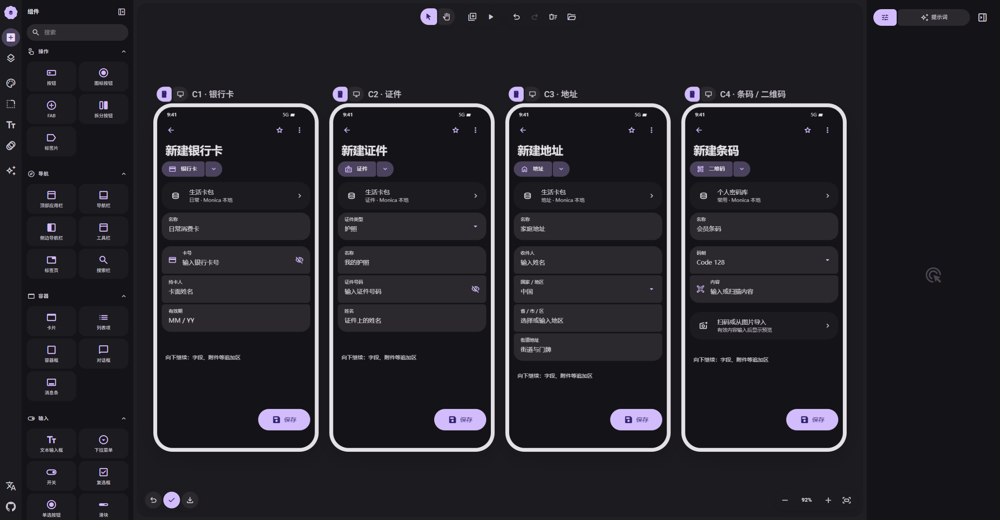

# 03 · 卡包与条码

[在 M3E Canvas 编辑](https://lnkiai.github.io/m3e-canvas/#docz=3Vxdb9NYGv4rVa6p8MfxF5eDtB_a5W610mg1ipzEpRFpnHXc0i5CallaWigUKBSmFIbOwpQB2oKGKSEBKu1P2Ynt5Iq_sOfkOIntbTfvOUnT6dwg7NrHz3vO83499smllJt3C1bqTEqQR_79fsS7uektz9crt_zHm8HTudSpVMbJW2P47-fsYj5rjvhrb7xatbn588hfJXJDY-dzY2czeLH_5eOyv_HS23kS3Hrz5eMjb_uBv_PzL7NzwfU9f3YOj1ivPqtX7za25vy1D_7mor92zd_81y-zV_AzxhxzgmAojdtFCx-XCqY7ZjsT-JRZzDl2PkdOmgXLda0_WTPkykmnVCCXuuMWufVSKmc6F1JnXGfSwphtd_ycnbPK7RNZu-g6ZtnFd5ZdPKTpkBHL42aJPNaxJ4s5i5wZw9eRa2bKrjWBjydsN28X8RlruuRY5XJ-ykpdDvHiwf92KYWhnUmNCfjaIrXhrEimpbm619hcxrOJ_zCdOiOcSs20_s2cJ8NPOmNmlqAv2i65h856cON18OpGgGfz9gKeF29nyZt_gRcBTyK-oPn4-9PB_FawdI0cr9zBp_ATgu2l5ux6Y_-a_-id92zdf1_zrj_FS-GtPKjvP_avP_Pvv_Fv7vjLS3hZ_I2lxtZVb_FbfI23S56BjWmbIEZMoCu7O1ev7VH8SO1hQfC25j254S385O2s06X3n242Xy4TO7ZWvds3MQG8lffYGv9pxdv_p_f2fvCsinnS2P0hqC00qq_qtU_1_U1_bpeYt_HGezxLyNMyGKNvbsziW7yPs3HQUgQ05W_rTgrakHpN-6NP3s5e88e33vUX3v5844fwwUFt1X9yFYPDEP2rK_VKtV7Zxnxtw7riP__ovb2C8TXm7gU_1bq45197KxW8JhQxXQ18PXYXvHzeym699jyobQW1bb-2jh8aN0aOGIOIMdQHR06P1KvLQe0d9UdsmCjrvZaj9ZD6p_3g3gu68HSscJm2H3pXyMPxGW9xj9jxedWbf-7dXW5-f7WxtYgXDq--d_sW5hC-GPOpXrnZ2N3FoxG2YWLvLjTvPqejtYz45lTqPHajUsQpBHn0olnAPjsqUtgSaoEWpVMpczqPr8RHp1J57GmH3nUhXyQnXWvaxUdTppM3Ww7q2kWzQG7OEu8sThYKp1IFM2MV8N-MM4jcWs7_w6IPy9iFHA0El7_pzHb3ORJFJ0sqEzyJE57y-5GR_6y9OQDhmFkoHwxRDtddaiGUVRhCuYuQAPlq0sW4Ul0kHYAp03Hsi-mMmb3QgYX0mEHEwgOhoXD2yPUM2BAY24TtWOkpy3GZoSkh7QyVCZoChoZTiZPO2E7OcpjBqSE46sgGgmFTOUkXZu1IUqJoZaGne4hSjHyiAZxGMeIghXzZ_SPNqIfhxfnbNTNm2YrMdHDvO_9djSZHAnmyVLIdN18kIc9_8NyrVEiUbBcmG69xfA7Hk_AV2XFryrGLaSd_frxLHlnHCzSWLxS6YfMsTvpmvmg5f7Yvhvf_jl5QJOXIwbMSd0lJg85KxCkz9nTPBYyAJv_FdmnSofj_gC3F9ztmLj9Z_otdoiGXHn5lYxpP0DN4ZrIXrHbEiTD7YFNDF5eoh0s61FTESVZcLQRbbAFSVGIYZUEHYlR4HapFP39vsfHuQ9ShRBUAVk2Ec6Dzi-oxc0dnpo5GLVVp5pc1qKUaL3VwrFh5z0YdPY4RHN90Toy01urE4hheCHuMkD1hVgNHHgOc17KOlcu76WzYJTHlNUlIFARQfK0bYfim8uV8Jl_IuzNpe2yMHaIY8z-EBCBCcaj-p_ftfpIUi4pIgRrKW9v6y6RTrVerTB4oyXGYGrQClzlh0m6a9qVMviehGHMUEcptdLzMYU_6UjyhKhLUUu6EilvU-4v-xnds1FHjMBEw70u8hfS5c7gd__prNtZosVpfRdC55M6Ct-_UKzeoBvDl43pHimt-e7Ve2wu2lxr7n4gEtBzxUwSwI8yUUpgqNQMaTyKpMpMM61RiiDRV5pTVhUWatq7RxAMwhQ9GF-ZFpLPJDJLBOcusOoMcZkZNZxMaZIETIJfSEObGVhBm0RoiufHoxAY5TGi6wKY2yBIYHb_cIIdpTFPY9AYZrtP0IzjIqO0fbJKDzNvGUc2hoyKDBQckxCkIVhxQxFGOQHGglhyb4oASngmWHNBwy9ZBSA5IanOVUXNAvJUrXVwqaDMFTCTHoYKlB8RbvfrXnwXzW0wVCELxuCnpUJBwnZaG9Zxjl9I5-2KROT4hJZl5gAEKKcfMb-a-DKkJzkB1EcRbtnJIakhLgASHYd6y1V-8E6xf5aG3HqcOuKNH-lCp039Hj4z4ooBbesRb5dLASF_dMvFHERJQoW29wlvvUmHtYMAAFiliPEgiBQoYXvv2qVwpUpzoYAFCkY6X6OwlgJLIq2AFQuFWhRJ6EITjKAESqj8ovEU1ZXe9ch1HSg4BS2knWZ1Ri1B4dZ0j0iKUMIVqEqMWoURfohyVFqGEudNAbFqEwps6WbUIJcyYooTYxAiF960HjxihhNnOkNnECAX-qqMPMUIV2nOosqkRKvxNB78aoXZecohscoQKz2Z9ff8gtV2E8QsI7ncTLTmi830YWI5Q9TgJwXKEGnGVI5AjqCXHJkeoCd8EyxFqxDlPiByhCW2uMsoRGm8py9GvaWIcJFiI0Hg_tPN29rzqdsKjIFWIJqUScR3o_Npwy9gBtPqanFgVaKuvcctD9_ZIhcj4DlZDCZzQKKdxV7L0k1P2GlZT4uwBd_vacIWi_rt9TY0vCrjb17h1otYX0SOnW99RLzNSSEughTb8Gm_VW69sY8Bs5OkUvipjl69F0vkRS6FaIreC23xtuLm1f4bricwK7vJ13swabJAP6r3KFfIvI8P1RIoFt_s6b4ptzi75N370F9fCaJnwSgDh9USuVQwg3_UTJxnpiVyrClBTeXNtY_NBc241WQFBmJRIt6oELAt07nTbglqv3Go-eBEsLbNxqJ1xw15NhTZr-q9MNdLbX96KOqNspA9DNtLDDCoigU030oelG-nt9KkJbLqRPkzdSG9_IisbbMKRPhThyGgLR5rEJhwZwxCOjLZwpGpswpExHOHIkDpOwqYcGf0pR50NsWDlyNATNARLR0b_0lG98hL3gN7uAtnjV11NJdWjSiW49-LY1CMj6aFg-cg4efKRKAgdyrLuoRGGqCCJgpjACd9HI_BWuHWc3e88TDgXaB-EIKWSUR66vUQ4cTqSKMjJtQFvphF4y1u6PZiRQyiJE7yhRuCtbc_aOWtEbH1lzMIfJZmGwVtpBPge0X61AFFQEzQH61301hPVwolCpwQOX52CNS96K1eoXJj3dj4w0lxP4oSqXfRWfsXUX1zzl175KytJ2CDOd_OuyiZ_0VthnP-7k85il0yXs2axyFHiiaKQ4LwCLULprQylk5nLpc10adx27YgteIbJT1UsrtVrt7xHn4Ola97uRzz5yTKK7lqhKxFKNLdv-Q8_B8-q9JcUhlVQiWI3d4dNOnhlRe4XQEfTpYudLecqYmzTxeiu8yPr08eE0XHLxM3L6JQy2hp8NGtPlMysO5qxczOp2H55BFyG3oPGInnE6yBBXSRwwqBO8kebcRa-Mmc6Mx3OJSoX4X9iukB-TcfBV5bJr-64BXrKdTDj8NKGhxlyeJl18lqwo1ulBjF54aA9IlciLHUocuBWWIHVMPogus04tAzqnYBR467bkY4jP_YAYgjq2dD-HyyuY-YLJCa2364MbP0iI_fjACSSAPmfoLdK2d2iNT3MtA6Z6W1Nl8xirj1D-sBmqDMuJ8fp_WkiGfXkuAiIfJ2NO2Dbeo7aV-gjCfHXEfoOt7Mb-tqfZg5i9vqLfRkzd74fRkSiniKxhr3ewx4c9jr7zQYV8w4HEo95ioYGtm4nLeYdbkk05ikaa1YAjDuEmCcBYl7n60CwbT1H_Y3EvMPt7Ma89ovFQcxefzFv3J7ohxCRkGforCGv97AHh7zO--dBhbzDgSTKPEFmjXmgoU9EzDvcklidJ8isQQ8w8BCCngxpcTsvtsDG9Rz2N9LkHm5nN-p1pJpBTF9_Ya-t2El98CIS-0SEWINf73EPDn7Rn0YdVPw7HEsi_ikCq3ODhj4R8e9wS2LxTxFYG13AwIOOf99c_i8)

[JSON 备份](03-wallet.json)

- **C1 · 银行卡**：卡包独立管理。安全码、卡面/照片、发卡行等通过更多添加，受保护数据按现有规则加密。
- **C2 · 证件**：类型决定字段校验。姓名与号码核心展示；详细身份信息、地址、照片按需展开。
- **C3 · 地址**：国家驱动必要地址结构；示意为中文地址。楼层、联系信息、公司等按需添加。页面可以继续滚动。
- **C4 · 条码 / 二维码**：继续使用现有条码类型存储。码制、输入和预览验证后保存，不误用通行密钥类型。

