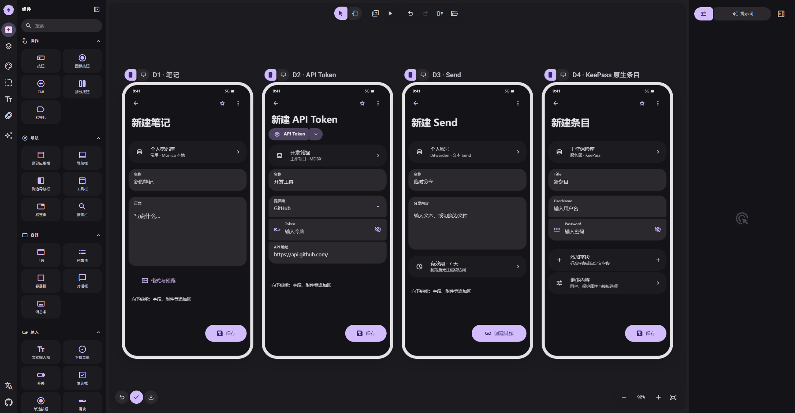

# 04 · 笔记与专用类型

[在 M3E Canvas 编辑](https://lnkiai.github.io/m3e-canvas/#docz=1Vxbb9tGFv4rgp7tRiSHpOS3zWa3LbpZFNjsosAiMCiLjgnLokBRjr1BALmb2HLqW-vEjm-xnTrNpbHqdNNYtnwB-lMaDik95S_sDIeUSKaxNSPbQV-CkOIMv3Pm3M-hb8VNzcyq8Z54AsR-3Y05L-_XKztWdcaqzjv3nzmvavDRN_GueNrQ1H701FU9p_UpMXthB9b2G5u_xP7F42X1ylG9suk8O353MGWvvoCVR87MzruDFbi9aFd-eVsac-69sUtjeN_9LWv_u_rTMXthz94s2wsT9ub3b0tfo3f0G8oQRpIf0HMqus5nFbNfN4bQLSWXMXQtg28qWdU01S_UUfxk0chn8aPmgIqX3opnFGMw3mMaRRVh1s2Bq3pGLfg3-vScaSgFE60smGhLxcA7FgaUPH6toRdzGRXf6UfP4WdGC6Y6hK6HdFPTc-iOOpI31EJBG1bjtz28aPN_34ojaD3x_gR6NkdouMK1uInujsR7El3xUfff9A28d9HoV_ow9Jxu4gX29veIF9bBQ3i3jJh4FdGR0W_mYo3Hd-pPy_bUZGO1ZE_Ow4MSYpa9MeFsH1m1u_bPx_iU3NfA3Z_t1cn6fw_hvRW0g1Wdtiefw1cPrOq-PVlCP9lrm85KxVm-g0_v3jp6EvP9dpcPnwvAd0_1T19-HrumD6o5QgGQTqGhsTQHK8vo5NHLYlevXP4qBmfWnfvrRIow7tk562gFPhhHguDuDld34FoJURcr9KEjVGKNF1P1n8aIFDnrT4j8WMdrzoOlMFg-AFbAYP-h5jIEZ4o_BSdinHXoMo5AvayZN5EsqDl3EyS29uKGff9NfXGWcBOWlzA3Hx45W_v2w3XEfYTFqtbs-WnrcBWWV7AuzB_ZM08I3_Gq2Rf1uUN79SWmcOcVHJuwy3OI6WEihAARrvp9oapfKoWCxzdyYIQoTkieJkGuLJCVhG-XEOPse1sILzxeREoIy-NO7U59_0erdgi_m3ImywigvbGJmI6Ibqw9apSW0RYxDOGmbmT-gtRlNFY_fAm3H-LTe7Zprx2j3VwLgam0qo9dgq53xW8g9ckHlCEBupH6qUa3mtFM3Sh0c4QOHrhUcHxXXBnR0AJ01RXXkKKdtnhQy-HfTHXERFfDiqEprpqaek7J4j36sI7mitlsVzyrpNUs-i3VA_DSgvYflbwzrWczxBzcvt48h_dexxOsAi-xgOUZwYqfxmK_Lez8Dt5-JVs4EbDgCQnv4hUkKrxCCy-GdbloIpTxFq4m3LhiGPrN3rTSN9gECZIh8jC9JwEFHmfxMnqkoG2kQ7qh9g6rhskKVPTENSWxABXbBoockdGbRsqmGqxQJQ8qsQ9cgk5aJUZpJSFA08MR5ELbKiaHJJZLAirQcgt0ViuYnxM__SHgKCowlbRSUAMnYFVfWPv78KdxZ2MM7s9jCor5vG6YWg5bV1itYkuITLIf8bim3NuSR08gfzVs6LleQ7sx0JIyIYnOrl_LZlsW-s8omlC0nGr8Tb_prf8reSCH45yTmJQMMYmX6YQw2WJSWh859WADBOD_Ihpl_oO0fIaoRusNJaMVC9f0PDHs5PKyjqR9iNxBXOobVH0TFlCAk8hOeQJNbASfpCM7xSjQcG7aecpkfblECLCQSNI5twS7CqJoLqKCnNQ-bi7iNihxc50KGM9_WFvOVcI4PnxiScpwhNXFkyifScaEEGKArT0NYoFVK8aXnK_3rFrJ2iv_VvqhBT3ZPnQQEjOJo9NnLuD101FHam8cwINZlE6QPCkQAHgJVAsw9uQUXpXzIwDiVqUUJWqRleFz31rVb5zaU6e2_e5guZlBN5buWLU3zvZk_RjlJBtwar9FGmj_LPxgQSJxuJyilCPphMNA6QbKFAKxjTKstkAKIf5jrUdaeyJWL0YASbacQWY8AcakgfO8tZxkyhq4JCPcDtIGzvO0QGZKHLiAqz33zIH3nGwywZQ68Im2sXacO_CeX5VFpuSB59qGegbZA8_7WkYMXYouEueZXaGbP4RqTF6AkGg7TU-GxZejtNF8QOUY0wh4UIKz38KJbXu68l4OsfvEOlxtbO45KxU3k7hy-asLTiD4iILTphB8QMP_WDmEkPDFmi2LEFiDcvY0QuDCkGnzCIG1SuYJ8e4TeHeXJY8Q-HjEjdDZEIH_yFKWZBUyIXJiMiXhrFF5s5DOJGcggprSbAqAEfWnmvlZMc0kYWLE-VPaMaH9ghyJVDKGnu8N5Q-UblWQwjoBAF2gLUgXqhPJM1MJL2gXvUI_ECnpZo3aw0EEjTokI4hlusBdYA3c60fz8O4Tq7blTE4xKUXTuUseqymBtx--D6qjrIoAInE7LUrQfuA-rBW0tJbVzNFevb-fGTAX1lyRsl4BOi6Ldaa5zCETaGYC5KREnpJw1lSg1Qlm0V8QccIioAubAKsTHjDNfKHn0iUlr31yQzMHiulP-vShSyyqDJou2as2UVpNwOqSz7faBDy3LfNs1SYQcNvnXW0CnsNOAaZqE2DtozFWm0CzgQaYyk2A1c92UG4CnqdNCUzlJhBwtOffqE75_JXYWtXtO9fOe9UJX3TZWsBiBw0oXMPxRm9oW8AiFxYH2iawGHC0HXWB669_gLNu5hss37Smgn7djeE5tdWXPqUXWcIR-TCXaEs44sdOrpnjEVHwxZqthCMy97yYSzgiCEOmLeGIrH7cqr62F9_A8ri1_yNLACKKUdNMCVzsVMo4XDv5KGImRc6Mshkssnp-clpw_C6s7DEJmxwGTtsTFllDAJK4EpOIRzXLC7A8YU8_xpOmCxMobmSSwEhwIEqUx0BZzMcDp5liNugN8Izsg7K9uo4tvhyDW8-jPgGWd9DPcG4GT4j-7wGJm-uV48Zi5aLdQirs8yWZ8vDZx2TOM2OQvFCG4zy6aFMGKRDLvJcyBEd1W5KQ1XKtMJHDGRhV4iD5UzQgwZQ5SBc83Cp5AQUnJ5gyB-kjzLdK_oCrkGJKHaSLnHGV_HkXmWdKHaQLHHOVPL_PSTJTr1q62ElXqalqjMOunU27NgfyaVMdSY7IL22uI3U-8Ura0dbxWmPp-e9MvNqr0_DeJlx6FvgO4YJ9mpSMcIk215H-sCOvUqop2WzJjsTqz6-5338x2GQ5EYFMm-zIHZQdIppIEWfKXDzqSihnzy-2vn923WqZjx4YZbtaZvX8_yyoxt_xd04sYiZEUVO2q2XWMgBJc5z7z-zyLpybZhI2EBE22jawDC5U2M6umST7gQUAbI1gmXWA1v96jUnYpChqymawzBpgEGEj36MwSVorwmDrBsuBCOOUSC4f5TBlGCf7ft4PkKmxtt8JOJuesJyK6LFIq8cB99xO_KZkMgFy7N0aTqndVPu9uG1jAk6Mk9_s8kJ94gWsLFt7k82n_QiObHkunyklItyhHfFPJui4YxZzobrNymu4tdwqpAXZQ8oSb0tj5FtY-OqRXXpqVWfIx6yN0mRjc--Cw9ykH4FIgK0tmgxGIOfcFu3nugdUBeVs3cNit_uO7j59KK_0md1pPTMaDw_gAjo9Pn3zkOsLaHc7XpDD-ZnnBbG6-geooiczijHaPMJIwJV4zwkm8N8OMNCTBfw3BswsuWUaSNKRgfYu0_jyNiMvXfShEYAz5KW3-SkGM2IOW8oWGqwCCUYKyZu8SSuPREqz38buYdcbHDDx58PakhzQbmJ_AiTTUJDfQUbIpVnyi21nd6yBF3SiJtgItaklESWQiA64wk8u0-4lqxKoI3nF_yMOkhftnyG_mtszKgJZ34trbmF1uH77_w)

[JSON 备份](04-other-editors.json)

- **D1 · 笔记**：正文优先，Markdown 预览按需打开。标签仅沿用笔记已有能力，不扩展为所有条目的新功能。
- **D2 · API Token**：限定现有 MDBX 原生类型。提供商与 API 地址按 schema 验证，未知字段保留。
- **D3 · Send**：仅使用现有 Bitwarden Send；无收藏能力则不显示星标。主操作创建链接，不能只落本地就假成功。
- **D4 · KeePass 原生条目**：沿用原生字段/保护标志、分组身份和版本校验；非通用 PasswordEntry 转存。模板标记不能丢。

