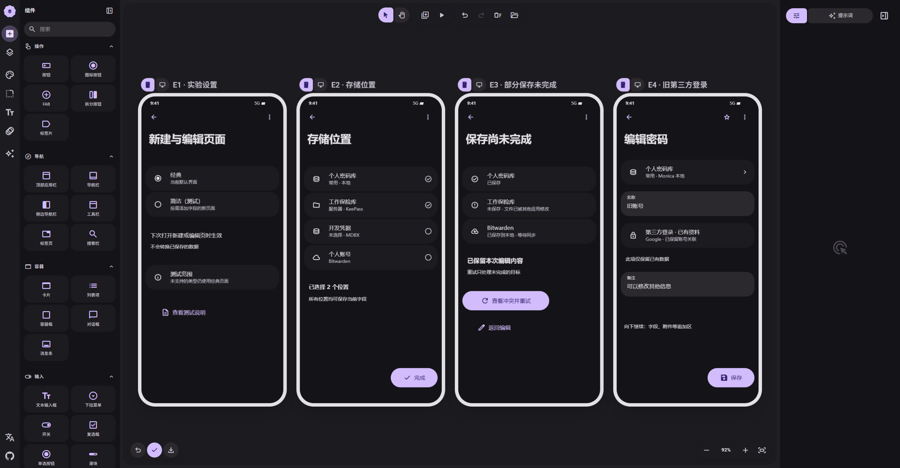

# 05 · 试用与保存状态

[在 M3E Canvas 编辑](https://lnkiai.github.io/m3e-canvas/#docz=1VtrT9tKGv4ryJ-pNr7lwsfu5ezqbLUrndVqpVWFTOKA1RBHjtPLVpWSU24ppKFboFxS2rS0UA4EDodySUiR9qec4xk7n_gLO-NxEjvAkowLR_sF1Y49ft5n3ssz70wfM7qiJ2RmgAmIff857LN25s25DePouXH6Gmwvms8OYDbH9DNDmiLH0VN31KQSlfrgwi6oVRvlz31_5-zXKl-sStncOD07mYGlTVBZNZ_vnp2sgO1XsPL5l2yODITHra4Z1X9b6zm4cAzLU3BhEpbf_5L9Hn0jrkmjGElqRE3K6DqVkPS4qo2iW1IypqlKDN-UErKuy9_Kj_CTGS2VwI_qIzJ-9TETk7R7zICuZWSEWdVH7qgxOd28EVWTuialdfRmWkdDShoeMT0ipfBnNTWTjMn4Thw9h595lNblUXQ9quqKmkR35IcpTU6nlfsy88TBiwb_52MGQRtg4gH0bJLY8HsW04J4aGzOIHLMegX99pAZCPQzj-y_Q8P4CxktLkWxAUlVx6-ZtSIYP2rUFq3KGqLPrGThPmKtCj9Po5lpZPON8jEiyziahltlmH8JTrLm3Bs4P4V4N44KVn0LFt7B-V1YqIDqS3KzMZeFOzlQfwnyBauQR5OE6X7S30TNulDbk4nmHXy_YdQLLdRC8ArcCBkoLpgrFfh2Ek0ymlWjdgDWjpENxlEWQUF_zfc5a38ffRs5iLX-vjGXw-AWa3D7nXmyYH15geHWJ8DpeKNcIw-AWccP7XEK1tN64_USYgesrFqzdTC1C0tboLTrtYdz2cNjexpPN8DUBBnIds4ZODVLDItwV03IWhWOFeH8eGO5ZNZewtXS2ckyGsqcXyJcItCguNmYLKD5aQ1OZgmMf2gsvgFfxsHsDNz-gHkpFcCzMljaQM-AZ2-QSegnZBtc_II-BA73nKhbHrOqPxi1emNxD40M1gpeC3mXhQK2EL5aN7e2jKM8CipzqQbq88Q8lg9fYR8KX_jqLQ7nd6t93333lz4EGhRxQKIxrc9jcGHJAVfctHZq8MWi9TGHg3zuGMwWzPXd34C1SfjTBnx1AJ6_gW8PCTeYlbUfkV-CE5JPCqC4aH6qonxgbn00jvZsg-72M8Mo6lKuGAqIt9IovpXkcPoWitBbaSku649uscQeTrCtYbl-RnqooNfQVT-joCjtboh7ShI_ocsPdXR1X9IUyY50XU1KCTxSFId5MpNI9DMJaUhOoN8iAwJ-Na38SyZfHlITMZJRntxtzcklH-UIbp4L0gPnKIGL3_T1_bywewH2uJRIdwGed5yIs7HzQQrsfBs7hng7oyPETBtjCzojaZr6YHBIit5rARbCHlOx7VeDFhzG8cu0qIWuUY-qmjx4X9Z0f6BFx71JsLIBGjcRKd2ElHKUnEgSRjW98fpdyxy-R4cPenyGo7Ik2LYkoaT1P5EifJk1jCbFFHVwyJ6kweiIHL1nF_GmfaSkYoMyqZSq4a-hu6QckkJrzs8Qk_GAXJMfx_4wms-4kki0k-dvkTqQlKSs_Vl94Lz0B_JAEuuWqzkKeTkKhSk4CvngKJO8gCVbaZydTBGlcXaS72QMzuQbpSw8rIFnb4msQ2UKOU_LYW6IvbCnFPARgYK9MGWsuHUXiRs4tdCKG1QDiRhrp9xgjyk34jFO4GhcI0JtXME4WSYS0i1FiJxs2yT0aBMb8Pi7EAnQVO9Abw6vJOOqy72JV1szT8HK_jnHLm3CuR04k0O2mj_WwOq0USsY9VOkWxw5fsMezrIewoIBKsJcemeos4DBNx_M0rRDys4-XHzeZg6tl6KakrJXPE0rOVyZeq5qrKN-hLAf2UYrf3zpNtbRPqGwD-HG8pTQfSs31lFBQsiHdmO7l0FfS7yxjhAKB3yoN1bsGvdXkm9ssOnofgQcG6R0l471Op1wY0Nel-ECNIWV7VGXxCRdGpLSMuMuQ5tGtQp2Jsy3OVB9eU64HR2hxGwveu21fzstM7aqGYwqWtTuCV1jgg53cBWmytDh3riKo9mUNRdT4PCDUS-hOt1Y-nQBU61mAybrW1n-q5RO_ypsRTqSkUgV1RHfnoVEGyi-AJPbjpzpEAGNbB5Of8Jk3fnd7X-4mLpUPF8fZ1zAy5nAU3UOehRN0YSaiZ0LRWv_IygedhJ2W9EfSFpMTv7KRLFejSEKNGmLo20OIZ3suA3Xh9ny5uC2_O-yW9QhmESqvMLRKiaYz8JSntgAXk-C4g5ZA5C1Mlnz0S8DuKakchY3Iap1AOfSVOdkbauz2_Rn7IBtxFhNtJnAjoicswvgjpiKCD5kLCdQToq_9qPYXEkIfhqQtK0l3zqWc4RVhPehYzmXrrohHcu1WjxBH0KWC3UN_CsJWS7cdHU_Qpajbq-QdLO77N6loZOzXMTrOXRylutRdHRoqm4lbbPZ0i6l191i4AMd9FBVGr5HfSGj8NIG1YyeUJIeYXaVkN0k_Niqn2wtHu5Z734A4wdGbQFU5_AW02kFzh3fIINsR2qiUrU826ODYYU2mEklVMkt1Nxi7GLXau2VYg7N7XxrV_IGGeO8dVQIUjFGq24IFeb8EuIBbpVJ1xZMjIPKcbtAhXvLMjzvNUmkypc8bZ-I7DqD4iZYGzNnJ1pZEzcy7a14erXGC173Fukmy6V6LmlCgok9czMHjg-IMW1X1-S4JqdHWiZwIkcl33jRa0mQaoXAi__DEut0DqysEo9yZbuYors8S6Cox3xzO00I-NCePG1jyZf25JsaKBTwoT35ECV2_7vfjhZi-YifDXCXFroh8clHmsRzPsQnH-ka-FcSn0JznygYCvrYuw90jTutS9rgkKqRrpof5GwrTP3oZoG2C-HUMltfUitmgevwdztl9W6Eqz5fdwe4eRjxgkbwfU1NDmrK8EjbKa9D0wh8B2lciMpp3V0N9eGVE-8yCP-Tw12VS237I2IBvY-bc5n039QU2V4ml7dVFB2j5E6zXUcSpCtguqBBaAVA2FlPUNFA2yQhR9Hoc70gduDnAzQ77wL1GZxX6-0uK93JASHIdJYrKhN6PHyTUO1y1cpE3lOI9mnSwz1YypOjhJ2h_I2qDidk5ynnVKXNAxj_ycrN3dzaRAgxXqElBKmSH61agdtrjfKxURsnJBDO_B68EDoVjMjSrPIFl4T5v0xOkY7gFjkqGmjP1ZADsvTJSQx04heozgcGaPEXd4zaB9JfIR0X47QMczv0uUrs1EvBIM2MiNS7NrMvjKNps7Zu1rbPTpZb_0mhsTRm1A7M7bx1Wsen3Gaq9MEnNuVUUPCz3yG65NS5daena4iDS7rf3sq9dLvj7pP_Ag)

[JSON 备份](05-settings-and-safety.json)

- **E1 · 实验设置**：经典默认；简洁为测试选项。下次打开生效，不转换数据库，不销毁当前草稿。
- **E2 · 存储位置**：选取目标与文件夹；一库一磁贴。未解锁不阻止编辑，但必须解锁后保存；不能静默回落到本地。
- **E3 · 部分保存未完成**：示意故障结果：保留草稿，只重试未完成项。入队待同步与服务器成功不同；显示已保存的身份防重复。
- **E4 · 旧第三方登录**：V2 无新增 SSO 入口。旧资料显示只读摘要，改名称/备注时原样保留，失效引用不变空字符串。

