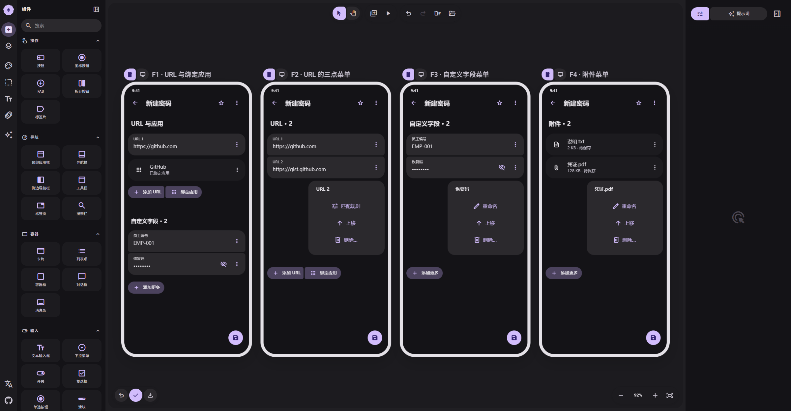

# 06 · URL 按钮组与逐项菜单

[在 M3E Canvas 编辑](https://lnkiai.github.io/m3e-canvas/#docz=1Vxbb9vIGf0rhp7tLC9DcujHFN1usRugKNp9KQKDkqiYiCwKFOXEDQLY2SS2E8vO1XEct7C33jjIxd622djxbYH-lI1ISU_7FzqjISWSpmXOyOY6QBCIDOfj-WbOdznkMDcytmEX9cxwhpMH_rc98Nc_fzPgzs22Hm029m7Xd-Zbkw9aax-bCytO7WlmMJO1DL2ALr5kloycNuAu_ujs7bbWfhr4VsCjm5uHzc21xquff92fc1deO5v_bMz_-Ov-C-fdM3fzp0-TU417H9zJKWS3vrte333U3JhyFz-6azPu4rS79q9Pk7fQPQqWNoYBlUfNko6Oy0XNLpjWGDqllfKWaeTxSa2o27b-tT6Br6xa5SK-1B7V8dAbmbxmXc0M21ZVR5hNe_SSmdcr_omcWbItrWKjkRUbmdQsbLEyqpXxbS2zWsrr-EwBXYevmajY-hg6HjNtwyyhM_r1sqVXKsa4nrnp4UXG_3Yjg6ANZwocurZEfPiS9ycV-dzYe-hsLju7TxpPXqFLrmeGucHMRPvv7BV8o6pV0HLYj5Jp49H1nfX6zuvG_beNN_c7i-LOPKjvTKIfaI6d9cX64caAAPNlNLnO3Tv4iBy0nr1vLT8ZAOTgzdKAJOOftzAW59EcQeHM3HX2J-s__8N5t4SXaeG_yEB9Z7Zx62P9YAVdUN-dd1feIgbgpbk56HvIBzwUfA8by7fJ0A5bkIdAPsFHdL0zvdc24NTWGrPT7spkEAe6MbHXerKMZq-59QNCg7C2Xi66K2_Q78bLKQx0p9b87sCd3WiuzSEg7vwjZ3fBfVxDbuB5mlltPV93Fl47B_92Htecg8fObA3fM-yWEHBLbPN5GnF4uf5xlhA46JgqnOCYu7WAFq81XXPWa2Q4ccvZuN_Ym3EWthD5iYsY4Nwd9_7b1vKD5rMFZ3If-ecuHaJD58WhuzrtPjl0Vl6Ri53tl8hIZ1aI383Dx870bmNjydm6i4aHvRIDXgHsVev57freh6AzvAhP8IaMcZ-tNjd3ncM7hDKfcCjfq--v1nfeuTOLzvZ_3JVZ5E3ruwN0QePpcwKZUBf7NDdLEoC78KB--ALPzcMD50EN2SELhqk6XWtuPcVsXlh0P8xgs-3Fa_t0eTBzBcVnORBtnDxUtYpDWg7HZmWIJw4JoO0OLwxmtOsGuhwdDWYMFMe9h141SvhfbP26jY7GNcvQ2jnANktaEVvI4QRQqhaLg5miltWL6N_UYYCHVoy_6-SOWbOYJ7nm5uXOMkRuJngTL7RxijIFTqGLE8O5WLURukwXTwdmRrMs89pIVstd7eADMOQW9vN4kNCbTFWmRwkTo0Q52BrJmlZet9hgqgSmiAfRwlQTwxwzLX1kXLdsNpA8500mCTSep0HZHszCTa_ydGoOAY4xJCEpz4dYystU4RSIp6x5_UTIBJoIIfkpZIYVdLuCUSx289HvUEXWjJJufWVcGUXjLS1vVCt_Mcsk4snhRROt4Rg5kxvVc1dRMR8uaMWKHljWHk57oSkQNvEKldNCHwsVl0XauHuAFcNgVUADVmQEO2rb5crwF19cMezRavZCzhzrIpeTIgfhqOUVKuggtbiVQjEgAKq4lbowi0bF_iNpJI-b5YxWRqWt68QfDPurahbjrpbLpmUbJVybUZmNdJJ4tBDrajucjomhb8xr3tgvyQUl3G_3KFl-YJAMBgBHU7RYAyPSguH-ReiyDSastmJoEQGkiWkhECa_SSKDTHlMAKHUAFQqnwHjcjkPl5ztHxr7i87CNn06E6QQZomnyQmCxIj595f-NMRxgeybNIcJcjiHAar02x6dSg4TlBD9JQnSwFRSpT88pTIuwDCVZCqfISOV3KnvkdxrrE4xcF8NA1ap0qvKCPiXye9j_9AHg8iFg0FSaBwQubSCQfSaWpEDLDj5xDjHjYqRNYqGPTFiFgqMYEV_UglYSJURRTEx2Io2rh8DEYcuir0eIL1KAyCD6hZZKw2T7Ba9AgMUBuEtSomns1_lDTySKhKD9AbJOdq39gZeUwg5BvENkj_K6DPogehTlEV-A1ahhFVdqGFNqrwBCPOUTnqDQEx9Rh0r8IMTskhvwNr-MUpvIEfQUjV_QGZEexraGyjhoKXT3kBJLWphOAoEkaaJAzDVKDitxhWoYV4JgMpp1kYQR4FAHwUSF0FL1U1JrM81u1FQsS_0EwoSHw4FQaLCn7zS9hkKkldnZb_O8jSskASWUBAkoRMK7ede6T-Mlby6LYtev0bVX0j91O1AMEjJirbkFW3Ze0ImUqVVKVi0ozxy5j627tSaG7edmeddTtnVUrdpF_AUJ-eTFMYKRCreSz2w1nfuNTb2or1wtXzNe8_OglaOoIVUNJB7zWz77eIvky-7gPN6Ubf1EbNqFw3mCZZFP7GwKDc5HeUme4xVAYNyk1NVbrJHWFVkUG5yespN6bwz4xmkm5KidFM676BlBu2mpKbdFNEnKYt2U1hrQM8XD0l1nALCrKXTccrnqeMUP1QBi45TWHVcf68eFDkCmkrOKaxyjvndg6JEopdOxCmpiTgFhkOATsQpn6eIU9Qwm-hEnMIq4vp4_QC5CGIqIQdZhdzpvX-AfCQg6KQcTE3KwU7d9XapUQJNXnhP4w0E9F-dczKL8oRML8_PgfKEwPdbZZGekLU5jgnhhPIT-jtVOMiiP2EvTdfZqtkll543ugFAp42gHEFKpz5hLz13BuoTKlG4VPITKj3gnpX8hGonG7LoT5h8X2Q_-lP1ig4POAYBqrIWHSYBqvr1RVQZFKiavLz0q0BVn66ywqBA1eSNYf8bd73WEAkElq27ybcY91mxVbVDUxYJqrK2c2TTPZvy5DkuwlfK7btcILqS7F3M65WcZZTx6MAaNLfeu0vzF-y216FtjMLA1xexa52vCTJpbWTkuWgo02kSMp5mW6dta7nREQRfD6b-6XfNrakL5XwhOjW8AH_DyfHbU0lgafjI-M-x4-M5v9WVJJaWj4xnenIRYgJV08dzfp8qAZauj4xPp-3jOSmCla7vI-NTbPyQ5okCpur8yPi0Wz_UpnbKKkvvR8afffNX4IZGdQ01D0Pj0hD5CpXsefKnmgJzrK1wKHYEVvubVWfrLtFYiZITnywYC3y8R5LI4lKcsfRdEuJdUlUWl-KMpe-SGO8SDyQWn-Kspe4Trw7lzLEyOhzKmvkJX_uxVLEjlkK1PJACkuDncbvqlXWcQv2qrqMr85o10anrkZrOHanpHP5u20JXVvD33XaRnLKtzDB-QOgdZvHhzUTT1MYa_J6FeZo8SyckzEj67papfLc6AS4RdGLV2w5CsNN9lXTU1DGE3d5z7q3i76STLjdI-D0OH0dXUWZYiKOmzitfZULXNk_JYbZ92IOvAee6fOW9l_XM89QnYck3aiczNnDHAGN5b5M4HWVjbMVTNvJl3GmSVhSOz7GyRLXn_Yilc8LZRM4fyZzMzqeTOQM3PJo5ZaqHIjGmemVO98V7Z335lGkoczE09HfIyhzVLqMjps4JD0-j1gec6zLW3__PPE_pUDZwwwBlJT_e6LaSHbWVcrWX4xKn5P2nEpQrcV4z52lUezkux8remxHmeUqp2svxWdbrVSgpmzTNnmG1hzCGtP4eFrrFOGrqnJA2kfddKvob8Ji9Tyd5Bm4YYKIKWZJnjK3UCz7PKbFqSWXhYoyxc0_GIOagDOJY6Bhj7KyVe-COQSEEAAsj46ydHSUv3_w_)

[JSON 备份](06-url-actions.json)

- **F1 · URL 与绑定应用**：两个独立按钮组成一组，外侧 28dp、内侧 8dp、间隔 4dp、高 56dp。URL 和应用分开保存；右侧三点作用于本项。
- **F2 · URL 的三点菜单**：点击 URL 卡片最右侧三点。菜单锚定该项；首末项禁用不能执行的排序操作，删除只影响当前 URL。
- **F3 · 自定义字段菜单**：每个重复字段右侧始终可见三点，包括隐藏值；显隐图标放在三点左侧。菜单不能输出秘密值。
- **F4 · 附件菜单**：附件无论待保存、上传中或已有，都保留三点按钮；按状态提供重命名、排序、重试、取消或删除。

