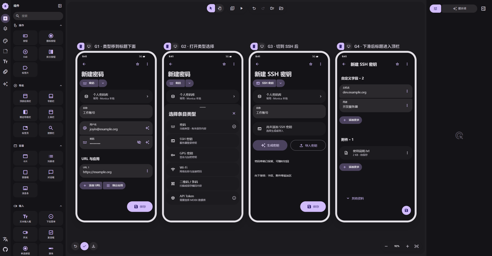

# 07 · 正文类型选择与收起标题

[在 M3E Canvas 编辑](https://lnkiai.github.io/m3e-canvas/#docz=3VxrTxtXGv4rlj9DO_cLn3azq6ZVW6nqZXelVYUGexxmMR7veCCwUSTSTQKEGHIhJAFCIU0KmxaHVgkQTIK0P6X1mbE_5S_sOT5je2Z8Yc6x400iRREzzDnzvO953ts573Ahbht2Wo8PxRk59t-DmLP7g7My6_5SBBsLlZl5Z-E_pcNFZ3m__PzA2ZytPLwXH4iPWIaegiM-NzNGQos5K3ugeFTZeh77C4emKBdelQtb7s7J6-PrzvoTUNhwF_deH6-B3btO4fnvM5fca_vOzCU4b-noUenoVnn7krPywtmagy92tn74feY7-I6UpY0jVNlRM6PD62xas1OmNQ5vaZmkZRpJdFNL67atf6pPoycnrGwaPWqP6mjohXhSs8biQ7Y1oUPMpj36uZnUc7UbCTNjW1rOhiNzNpxSs9CMuVEti15rmROZpI7upOBz6JnpnK2Pw-tx0zbMDLyjT2UtPZczJvX4RQ8vnPzvF-IQ2lA8xcBnM1iGsyxSC9apu10Ec3tYlaXDhcqDh_C5qfgQMxCfrv4_cg69bcJKaQkkTMa00RSVrX1ncwksPXHW58sny2BtA-oRLcvdJbQ-a8_Ao1WoOLwU4OlVd_MSeLRdf03p8Mh9tg1mb2IQzvX5yq2CW7wMV8X97gWYLYIbeXd7z5lbcQu74NEzZ_42OJ7B6w9XsbK6VN7aAfk7TnEVXNtBK3RxoCYo6xO0uv54sJ9CWERBOkXI0uFtd3nHPxCqx3mAeFQ6zDv3nmIGOQdFcG0T_wpCgbDA3F2w9gpKC5WCJUEsW96pzCyjOy9vg_k8WHgF50Q0PPgVKTE_DxkKf3CWbriPjvArKjPfIQCrl921ApzNufcK_gosfg_WNoMycz6ZeSQzmJuFyxr76quPY-DGIpZX5U5b1KqMtUFwEdHyNVZt0W-L9SWDQDAZSsW8c3cTvtjJP3QWt0vFfSicc3fbXfjZ_WkBy1c6eeDeuV_evgzm7peKV8AvG6WjxdLhtdLhjDs_h60uKBnvk0xAkkH2OMWbCF8VVvlkDVx5jBFgMVleOUXOukyQR5hB5ZMNt7iL3QrUG54OAvGvfXnrOlwqNKSqBjRw1lsnsHYECpDvl9CazebBozxeKqgAbBxwwsq_d8DVPPjlDuRiVcRvB-LnoFlnfUbKyIP2dFYfzJ037MToIIsF4oSqOCw3ENemDPg4vBqIG9D8Ow8dMzLoN7Y-ZcOrSc0ytKrrsM2MlkYzJJDfyEyk0wPxtDaip-Hv1CEBDc0Z_9LxG0fMdBK7qIvf1lcl9DIO4-Q5iRwoRwlUPBuL_bay1wJrSkvnOoDlPZZwVay8RICVb2BFkM5M2BBhvIGpDjWuWZZ5fnhES4zVAQpKQDQka3uQgqdRNIgUpRAZ5bhp6cOTumXTgRQ9eqoSOUgxMkgYDK3hEdNK6hYdTMmDiZ2CKhCglCjJ6Q97ddA8E82aWC7AUFYl0Svrs6e0kbM_wUlCO9gwJbG1ES2n-1RfOnxSOqrF7KPbCP9ENmtatpFB3hQcHsKYhDxxLd1a_xms73lTcvCJxKg-aZmZYcs4N9qgFq_ARUsZ6XTDI_8JpjKakdGtz8zz3viP8AMZlGR1UFHQiDmZSEU-Mx4xp05dVB989COUUObaSvIxlBmOt7SkMZH72sxi740vz5iQ5OP4DtRRYkyveSsf7zsI7TkFDvsETiESWqCkMk5fyN0sKwbQ8oxCglakRXvwuPRyvfzsR7B00MAsRcUshWIDia9gpf8zrRQ6VslYZgknGbxMJLNMuU7QgzhzB5BbFMRSgoDJ3KNCCfgf5rSR-YM-pY3Dmu4D0zpHwS7VY5cXLsmclho990jbupXRbH1YH9eMNF3Q5JhQBkKEtjo6ItoJ2xzWzus5c1ynhMoGrFYQGBKkbF-tVulRLOC4gBEIIpHMtDl3KKGJbLIcH0QrExUIPCXa32YetvxHbrmcELBcQSTCHz0fz2q53HkT7_tQ2IEYNFlCmNEz8h6YrBdoeUaggSpFhjpp5IwRI23Y08NmKkUJVg4UECIZVtoI-c2Xn8VKh4vgaBnGygZllYgVuRLwiaJKhNkXJN-lBJlTAymnxBAJrXaxUK22TE7bhmCCYDmSvItnKMGO2nY2N_Thh10lMjwbdDQSQ4SdjWy9Xe5P8J4RcF7ckVWSKMn7rSCMsXTyAOzeayDNaZMNV8iinZAGSmQIkMgdcHq8FRSKjT6elrdUO32Cx1pZodjqE2hZS73XJ3hMrWYcxPto0Yna9Xafl84pDM1-H9cvgxK8PE4WKXb8hOi7p11v-QlCzaIoNv0E2q2Srnb9RCZIVbJtP9FnWu_vtp9YM2fv4I4jKiREqlJPQM7GS2sklAK2kSWU0zQVeowvpcEHvhEyGpELRgaeJYlgIm2dh8-7nAdb7loBn4DVlxOlKZHozAc9GqeS7P-J0X1FIm3mKKsQUQiaHC8SmZxAZnK-4q65ng5YWvV4GOu9eny9Pu-sP8EZB7h6BRReBI0uMTacMKxEWn8zNicGlSTwRDYnkinJ1q1xA9-pKal6Gv30auXW47CinPU8uLYF7u-494vg5Z36Q55umoqTXmlECmpEJNraFiUyjYzp0z5lnP3ibBtluLuvwI08qhivbcIn-qYMOaQMhSTUijKZMs4bKcOnjb8agx8ZTYp4edMtruNjC6iO8smGs_i4bmlvWh1KUB2SROSwFTJ1_NMaTphJfZjzh_Gj627xGRQ29mEMefBm_-LM_-QsLTlzK9iluMcrKOKHHMsbU5AaVJBMdmqskinINsd0f9j44xefxL727gV0UlmfKf94yet_-fzPZ_4Wc-7sOfkCToRqztbIpMw34mQlL_lTBYoKUKItq6gqQKm-2y5QlIASbV8KdQkoeSmUylOUgFL00qrbElCqH2lLFDWgFD1h6rIGlGp74RxLUQRK0TfDu-_7EGtGRdP5QXsCjYvAWDBrIaoEZTbIWLJKUPZZ2PtbCcohqybrAJF9Zv0ubXDLfI3RNC0gMu1BGm0LiCwE4ZL1gMjUHStd9YDIYjwUL4hAd1_vgL1VWO7hnuJY--IH5yru8vfO3A2Yy4Gnx-BKH_J9WQqqRyDqkZH9PTJh149lCRQu8TaHjSyqMsJK7QDaK1JYlg613AE1VnwYNdS2PjyRTZta0gc6EL3MCTsNV6DTwYCsBCOYSMZF2l4X7PlxwzY4-BX3bL8-vg6WnqLu57v7qLl8baMhmBDVttSgPJJAtAy0Jx3gxs3S4YJb3HaLu6-PV-uffVTuXy4V993d-fLJS1Q1Xz8iF0lhatRSaA6ZFKYDtXp6yKTU8naBoagxlL72kyu1DlhepUjalf4l7UrtmF2SKZJhRYkMtOtkWKk1n8kcRXmhRO8-67K8UJk6TRmPpiQ-QqWthcuzT0BhtfRiHnsHlN1yPs8djbcqG-ItS-Sw1f72ovWqg1Tl6kuGqcXKRFLTnlKUDovO-hFVD6nKhyBzDInXVmkz6aQ--UFXrReqEDJjViEC3rdvQ1QxZAocUaxXxb6aQq_aMlUpzCuRSGra703wp4UUdiCH8RLV0Sptcxs4ngFLN-vnNxR2oITsgCM6u1OjR94u7YBlwgGNrFcXj6c6xK1mtyiQ-RKwiIGMZcKRTCBrs2dId6H0XMIystUvmX0e_uUJZHb56TPn3uIHdlX2QA3MxT49U_3Y9dWVQK7MtVy3nn6AxPAhBckCmYL8HyE11ZRX9kvFlfLzy87K_YaO9KmslkkOI8F8BiMQkbERPnARoLBEn3swBNu3_mIlaDKn1iopfnBU12CuOzgpDuI_B-DZkOjZEEmC0XK2oEV12ryNEng4NppdpRgflOpLBxPmeFZL2IMjZnI6HvjuTyAp0E6fORBNfesVRT4W-S4vsAq-HhgdPpnUrOl2XTBMU1xFbTCmBZ_MoT-IYKfxLduKDyHX712OoMuLVGqsYve3a_dMjd7Mp7A_ZIutuj88k2Co5MOvwl9TeAIS9aNHmLq1adRP0CPxJWKXUAc0tqUZaeTmve0Vober6Zu-G8NASW1EuwjRXsKsr9IdX45UL-loj2NDTVdSb3VVn5yS-60CVyf682J7rygRHXk0z9SVF-TeKi_oE67J61GrqTsvpyWjOTjfC5sdmkSUaraYqk1sxycq33z5WY-dGC-3oisv0SxE01RvK18p3JdPuAZfWa_jhVpPXRI2m81FY6zcirG1TX9CyjbP1ZqybvEmKKzWPwHraeRlI2Si9V50skhy6tTvUyraXtgGyWufIfRMj_3MRduj8BmCyFElo6fP3c9ktD2aYDIqylTJaKTp351ktL04_mRUlKmS0QiT9ykZTXERHGW9VYtMylOn7i76R6dDPxxle2EbjrLWGNAzPXbnKH3dOV0RxecoVYXKUZ4-d2tHSbyTFdlZtkcUqtwZUentmr6T3rK9OIHSnZF6bAD9dpeq2rIYqvVx8EQnw01zvSXVUCTx_TWOd_RDLX5_qnLfC_01juA5ZZ5o173FZJ3qcvwXY3vspFiG68RGUSH6m2TNk731dPRjbsFHegX0h5D-N7ZipEj0UWmr2d4cJb-9-D8)

[JSON 备份](07-type-switch.json)

- **G1 · 类型移到标题下面**：顶栏只有返回、收藏与更多。新建密码大标题下为紧凑类型按钮组；点击名称或箭头打开选择，随表单滚动。
- **G2 · 打开类型选择**：专用类型选择面板，不是字段添加面板。单列图标、名称、用途、当前勾选；已有草稿有提示，不适用的目标显示原因。
- **G3 · 切到 SSH 后**：选择 SSH 后更新大标题与正文类型按钮组。顶栏仍无切换控件；旧独立草稿保留规则仅属于上一版方案。
- **G4 · 下滑后标题进入顶栏**：大标题随滚动连续收起到顶栏。类型选择行已随正文滚出，不固定、不重复显示；返回顶部再展开。

