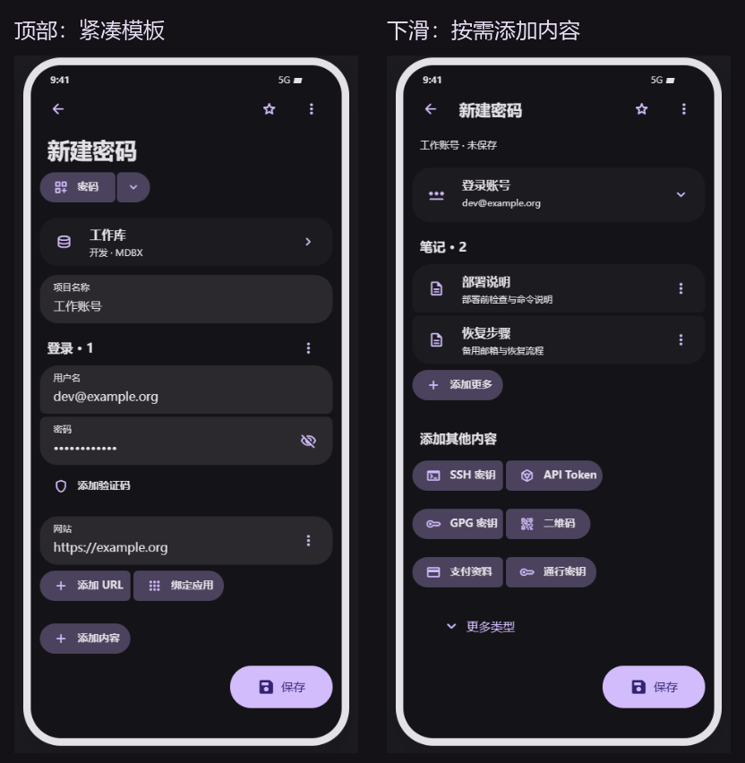

# 统一项目：模板新建与多页面联动

2026-09-20 · 设计提案 v2 · **尚未实现；本轮不修改应用代码或数据库。**

[M3E Canvas 设计与预览](canvas/index.md) · [需要审阅的取舍](decisions.md) · [存储与兼容方案](architecture.md) · [交互契约](interactions.md) · [源码依据](source-review.md) · [实施与验收](verification-plan.md)

## 想实现的体验

一个项目有一个存储位置，可以装下多个账号、笔记、验证码、密钥、二维码和支付资料。创建时选择的是起始模板，之后可以继续添加内容。

例如「工作账号」含一个登录账号、两篇笔记、一个验证码：密码列表显示账号入口，笔记列表显示两篇笔记，验证器显示验证码。它们都来自同一个项目。编辑「部署说明」只更新这个项目里的该篇笔记，不另存一份笔记再建立绑定。

多数入口打开同一个项目详情并定位相应内容。笔记保留阅读/Markdown 页面，二维码保留展示页；这些页面能返回原始项目。Steam 继续专用流程。

## 推荐决定

| 问题 | 决定 |
|---|---|
| 模板是否决定项目永远是什么类型 | 否。模板只添加初始内容；后续按需增加内容，不切换到另一个孤立草稿 |
| 一个项目含多份同类内容 | 支持，每份有稳定 ID、名称、顺序和独立编辑入口 |
| 批量创建如何处理 | 「批量新建」产生多个独立项目；「添加账号」在当前项目中追加账号，二者明确区分 |
| 数据库归属 | 归属、文件夹、共享权限在项目层；一个组件不能偷偷保存在另一个库 |
| 多目标创建 | 保留，但明确是分别保存副本，每个目标有独立身份和结果；不假定副本实时联动 |
| 旧数据 | 先通过兼容读取展示成项目；只看不写、不批量迁移。原有独立绑定不自动吞并 |
| 数据库版本 | 首选保持当前 Room schema 78；采用已有主记录加加密扩展存储。新扩展仍有自己的格式版本 |
| 降级保证 | 区分能打开、可见多少、编辑能否保留扩展；不能承诺任意旧版本完整读写新项目 |
| Bitwarden | 一个 Cipher 保留一个原生主类型；其他内容在验证通过的扩展中保存。官方客户端不会因此获得 Monica 的多组件 UI |
| Rust | 用于项目解析、列表投影、增量索引和差异合并；界面组合、焦点和动效由 Compose 处理 |
| 开关 | 经典新建仍为默认。开启试用才默认使用新编辑器；关闭试用不隐藏或删掉已保存的混合内容 |

难度确实比重做新建页高：真正需要重构的是读写入口与同步边界。可以分阶段做，不能用「几张表互相绑定」冒充统一项目，也不能为了不改数据库版本把所有秘密塞进普通备注或自定义字段。

## 本轮产物

- 5 张可编辑 M3E Canvas，20 个页面/状态：新建、共用详情、专用内容、批量创建、存储与生命周期。
- [包含两篇笔记的虚构项目示例](example-item.json)，明确列表身份与编辑归属；只是逻辑结构，不是可导入的生产格式。
- 四类数据库的落盘建议、旧版回写风险、分阶段放行条件。
- 同步冲突、移除内容、移出为独立项目、跨库移动、自动填充与 Passkey 的联动规则。

画布是浏览器中实际渲染的**设计稿**，不是 Android 已实现截图。渲染结果见 [检查记录](canvas/render-check.json)；功能验证尚未开始。

上一版 [new-entry-v2](../new-entry-v2/README.md) 保留为独立方案，并按最新反馈同步修订标题/选择控件位置。沿用其局部「添加更多」、URL 双按钮、逐项菜单和动效设计；本方案替换其「类型对应独立条目/草稿」的数据语义。

最新修订：大标题下方采用紧凑、居左的「当前模板＋展开箭头」按钮组；添加 URL／绑定应用、添加内容和各区追加操作也按内容宽度居左，视觉高度约 40dp。模板组随表单滚动，「新建密码」下滑后收进顶栏。旧方案与统一项目方案同步采用此布局。
