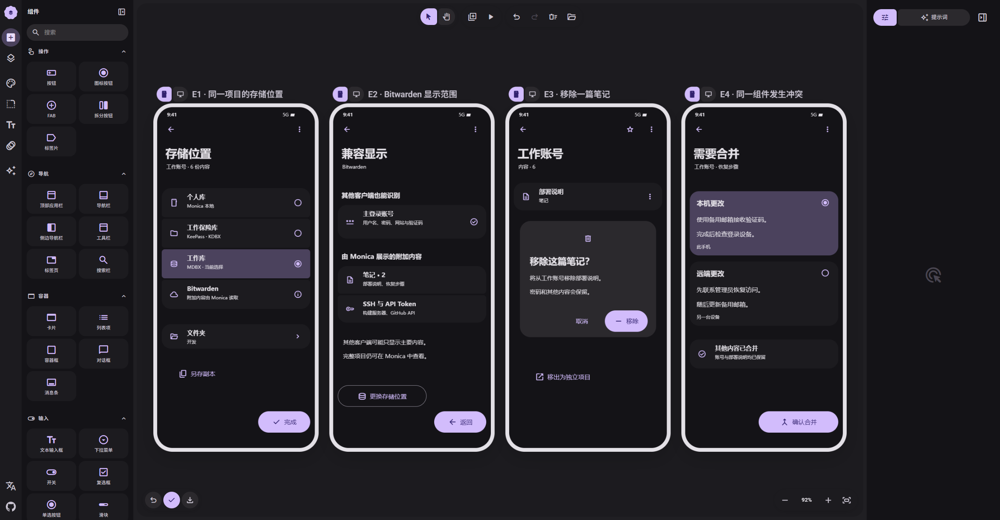

# 05 · 存储、移除与冲突

[在 M3E Canvas 编辑](https://lnkiai.github.io/m3e-canvas/#docz=zVzrTxtXFv9XLH9OuvN-5Fuzu2qrbqVK7UorrSo0mCFYMR40HpKwVSWTB48EMGkMgeCEkJKEksYmaZoQjIO0f0rrOzP-1H9h7507Y3umbJx7hrSVEMLDPM659_zO77zGX2edvFMws2eynJz576sMerqGLu_8Up72Hjc769vt_SU089zbnc6eyg7beXMUn_iZVcznjIzX3Gzvlztbr72NOrnSr7_x61veztGvhwtubRfV73lLe7-UL_vrd9x7V93Dqrd94K7suYv1Xw83_Okqur7jP76K5tb9x9OZfNExbSPn5K1i6YPxEXwZfuCobYwTySbGrKKJP08UDGfUssfxIaM4Ylv5EXLQKJiOY35qTpEzJ-2JAjnVGTPJpV9nRwz7fPaMY0-aWAHLGfvMGjFL0YGcVXRso-TgK0sOvqVhkzuWxowJ8ljbmiyOmOTIKD6PnDNVcsxx_HncIoLiI-alCdsslfIXzOw3obz45v_-OotFO5Md5fC5RarD3_lgdZcXumvm3blKF7vdWvRadXzqpewZ7lR2Kvg9fI48cNIeNXJEn6LlkLugym6nPI9v0d7fbe836ZV4OVHlEbnXfMOt_eCuNdy1JW-LPKDzZM07eIxXut2q4TWly48ObvlXWuj6BqrttI_uBhcuuve3OrsLeOva-4vu9evkd7XhLkzjm3jNq-3mS_fyVfyDZtbRxj38FFQje4u1jnTl-3QViK5n885FvKBmMeOuvcF77y9cQRsvqJqSMkjR2g6V0f2u7G4-7JTv-EezaHmJLNq1Q1R_7TdeEC23D9pvbmBB8GL4Lx6hyiv_pz20tOlVN9HT2279J2KL89-jZyv4ONbPb0zj-5CbXL-PGjN-q9Vu3cKX4xt2Zit_ce9e6awvE92bW_7LH93bL7vr01lruk8foNfkiLey7i_OU0snJ88f-Y0DVF9zV19n_vlJxlue8R9_h67tdK7s0LWLr5TQt1IiWakIamWvMev9UPXre3SVdGHAKtG7o7n7-HK84X6d4JVaFz2I5mbQYRk_nj4iQ647bWSw0OH_lxfC0xsz3v1p9O0CPWWYQLRSQ4sr2LLc2jy-HM0etPcPvBs_eE9u0GvIskfLgyoN99vtTrUcV1XsU1XqASCUu3KT7FPkXrDCvKgNsotnK3jPQyEzeCPb-9ve48X2Ud2tviYbee1lu7lK9FteoE-h_8L2hNVA157h42jzAM3O4M1Fy3N4Qwl8gj-webWbi51amVqbf1TznjS8-TmCqT50YLv0qjuZyYkRwzFHPnQy3vPb7p0X_qMZb2M1UP-rU9lz2HlM9LkCTj5dcizbOGeeLuRHzdxUrmCe5qnWghTozAunssalPL4IfzqVzWNX8y43OJ8vkv875iUHf7pg2HkjcFaOVTQK5D454qmKk4XCqWzBGDYL-H_6GYlcWsr_x6TPHbYKI9QpfvNVd_eOfaRAZRYFBSq0ABRa_iiT-Xl17xi5R41CaaDgYmhiQiC3KDHLLfbkJuKdnXSwtHHpqTpU-Kxh29bFoWEjdz7bU6IrvaQNElgKV1rSoBJLjBKPW7Y5dMG0HZjAcmjOFMI8x24aMtA0EjxKBRY5FrtWQuGpefBk0RmFV6DCv3qI2ZmyF3GRSqbdbKGZa5iTerYuMtm6GrN1AQBStafMsHXpnXXpLb6m0T-F7BkVu4rRfKHQ8-d_xfGUkS-a9j-si_gS2xjJT5a-tCaoL6Qfz1rYWnGoN9DstJjZCYLyAcesrsaIlNK4YTtRWAqAik5lVpVQZplZYh1obSRwPDjAIWDPthQWnPBcXHSZZ2ctDih7mHjQ6BPKAzwf-VUphcHwPKPFEKO2hoaD04Ymi7kxM3c-yC0A1sMLcXzrgMihj4V_V4BrzPjmxRjARQ60X6zsPYotyrSB-yPFMCJy7PDmJSBGKJvguLyz_n0KlMtxDUQAyqFk_qlpfm6USoQKP_3b2X-Bca7EcQ60G4XRbk4U53EeF1UAzt8XkZv4ohHDnuoiPTXM4zwuaqDtYiVynMMZw0YJSON8nMdFDQB0KJFToMMhLsSJXOLZIS6AiRzjOqgGtG6R0kp53r3xPRTnQoLPYYYjpOLzVCgX4mwuyYCU-k_D5oI0UN04nUsKaLtY6TxXsCah-xNnc0lhB7kAZfNuDRUK8jiPSzoA5FAe76wHVdYgkfWqzzJh9O43mqiyCkZ7gtWB5sPK6vniqAW0njiHywp7YUE4SQ5XpDTJ-DvAO07jsgraH1Yap9H6kDURIAWyTXEmlzUAUKBM7q7Okmr4dl-5hwnkYpzJFU5lr21CmRwdllHlJhTNYoK7YdYisnI3pusLNqZtO39uDFjrFOOkragAsftJe6DIGKRm0RnKWRNTfRL39_16m6ANRKkYkbBCF17VFXb5xbfKT5xMEBL1Fj1WCUf1BXduuSe0qAwUOiRiSQM3TEQoEafomIgRB2vglokI5eC0PZOQbSUV3jVhpdq0bRMxJFyNA_dNRJVR5pSNE1GLDBveOhE1oInQdjpt0fciBqbeiahH8sO7JyKUPY8JkdmaJRIXX31BYPflEpg_g341qj9w5155Txrt15v-lZbfmEFzT3r6qCybIfFxzAoyu2uX-hg1dcRJ_nyfEackJPYPFERIAiPmJ4xS6aJlA5NKKSRgWQz7KIrOLrIINLr2ftNbb6LWCm06AsNOSUqooLMnxhKUj73qDkYMWl78pTxNZ1fIyFrrpvdknYzABJM--CCU-CQ5IhEpjU3JjDYVxEhDubydKwArkpISB0MwUMMqNrST3Zfl0zkdMoHWVwWAejQ17tEkHuDRTrQOLrzXhraUCAckQYMYH3Mp3Czl7PxEMNkIsz097hAkAeDToGEAnZsjRWUB6M9kLiG-zO7PZGgcQEYFW8_pUCP2ZO70A7S96D592NndhvowOREISIA2sXySgQALbACFZTkRB8icBICNzBoHnDenYHCREyGADGgTy9AQ4IsvPs5gosx8-PknmS-t8-ACs5wIAmRAp1iGBgHuvauoeeDWFtH1LbROhtY_yjsfTw4TrcCokbOxIoPCsZONDJ5ji2cDqNIgQ9CVXZqdkRnnR9OUSumAfKihzKahktBQAvgF8LBbfcFdeUHnh9tNMjaMajtR0NDef-puPvRqN9JolwgWVIE9F5X7g4Xf4t-adArYafXVto7pIrsbL9zFB8cOJgqiMFCLMARQBXh9TtbeqkWyPnds3cU_qqKNe1mGIp0cBgG6BC7SydAYIEWRTgnJnxckcJVOgZJ_yiqdEhK9LoKrdAprCT1tlU7p1s_hA9kKK1WXHMMeGsY5O3SwS-kOkSvg4qLC2rpOWVxUpAiQ8OKikm4aLVFmYBzMliP5U4xmgwk5INtgKjsLLC8qShydvA6Qv49u_-DsdXAcrqhxgxN4DhCHK6w1-NTpqxJyrq6H9SzARJQCrcL353_AUFzRE_KL7H1gJV36DWUwtcu-YT8SZjMqx2gzKV2rGhFv-IqOAIC2mjrDJvX9ENoi9_-nOz7OnxtLgPu3SfZglSPeDmiEMCCgW6KyEveIWTAdcygMvIGbFXK3HvUyNcBmQdNt-vqlf7TefcPz18PNXkIgseBcleKKSCJAETCh7820m0v9tE5Vi9evwNmbKid0U9kDLBVM9tE7sGEaHnB_-_AOfeM3jVZhCMBzshZWSQBvZPXHAAMAk9Crsuq-nOsJzw2kcDUaWuNVDi7w27PoZP5pm-PWhX5sU8Pqic0PzJrViMHFaCoHgIy3Z81xv0TmzYbyxaGieTEu-G9flu6BXR6YQ6shk_MSB06i1T8gidYiGlc5cBKt_UFJtBZyOS_q4IRU-72zaC1i46DKBRSalYxTBk2a2DVueEKqQYm4UyuTGmrwvj8wIdWkrgLwjFQ7iYya5KXHd4rYUlRNTtg-ZARG66Pd1Dkqr2jv_KoRJEfVlO4ehqG7BNAYWgQnXyhROyAV4mpfT1xjMkK1i_xoy9grxBprjn1yL71oWnIDNIDrgmbb7daRV91B27P4d-dy3as_c5ceutWX3bmRWLCnsIFJT2gmCgD_Bn4rLJiqRctL9HtzwjGf-husawqddC6pk8zu8nQos7tPt935GxgxUG7Xk9wexFWs4p9kKzzm395HEU4XEjsmCQCVoV_VQr86J5WD06MwIXJwEs_uoXXWWvtJvr2rS8ktALz7o4PjhGtz_nTV-7Hp1be85Rl0c41GCn79qHO7nsYXyAm1ZECHXAe_VHanQpwbtqzVvX7_nUahZCwgAxriOrghXnnU3i-jyh510mAXF8UDkYtTOICx_Xm-9eUdPFwvgqB5hCIIgJqxzjoml35GU-9GCHL4xpbA3mnQwRFCX3ELvXqeSIVYvwyGS6oisTcd6F1APBOkQWTgt6_8iO7OYr1o0Q4KJ56LQgY5miMBTGDQu7x7CWzctM_FKmDBV_oldkjgiIF99c3_AA)

[JSON 备份](05-storage-lifecycle.json) · [交互说明](../interactions.md)

- **E1 · 同一项目的存储位置**：只选一个主位置；另存副本是明确的高级动作。数据库能力在保存前校验，不把不支持的组件悄悄写回本地。
- **E2 · Bitwarden 显示范围**：在能力检查通过后的兼容说明示例。主账号走原生字段，扩展走验证过的加密载体。容量/权限不满足时保存前阻止并保留草稿，不承诺官方 UI 理解全部组件。
- **E3 · 移除一篇笔记**：组件删除确认与项目删除分开。移除 note-a 不删除同项目密码和 note-b；菜单另有移出为独立项目。保存前可撤销。
- **E4 · 同一组件发生冲突**：展示 note-b 的两种修改。其他不同组件修改在有共同基准时合并；合并后仍需通过远端版本校验，不能用 updatedAt 粗暴覆盖。

