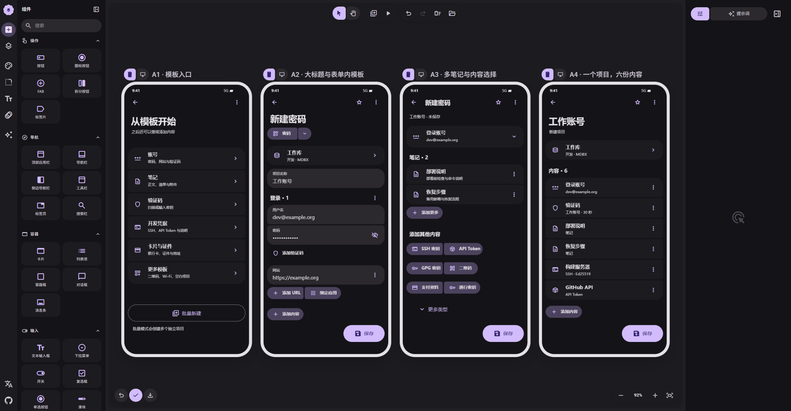
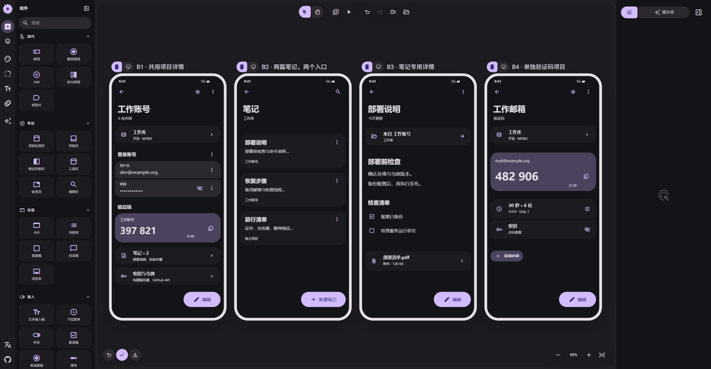
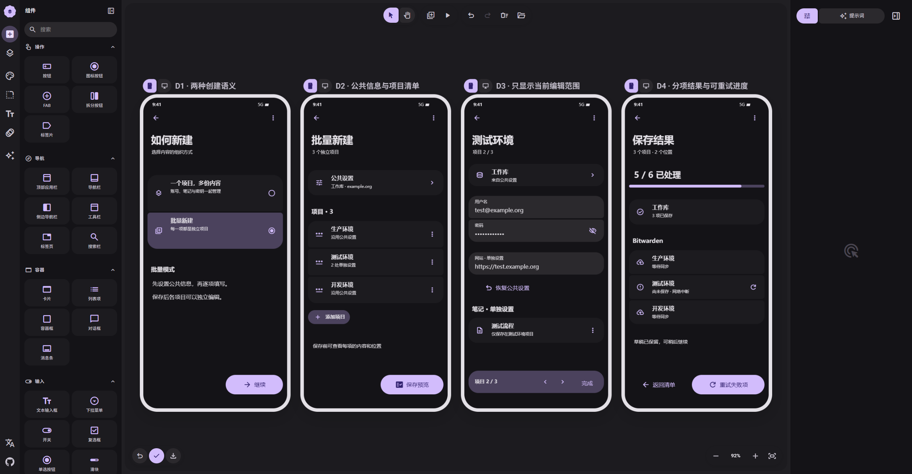

# 统一项目 · M3E Canvas

2026-09-20 · v2 · 5 张可编辑画布，20 个页面/状态。设计稿，尚未实现。

[方案总览](../README.md) · [交互契约](../interactions.md) · [存储兼容](../architecture.md)

每张页面内都有「在 M3E Canvas 编辑」链接及 JSON 备份；以下预览来自 Canvas 实际渲染。

最新修订：[紧凑模板与追加按钮预览](compact-controls-preview.png)。模板名称＋箭头、添加 URL／绑定应用、添加内容均缩至内容宽度并居左；保留标题滚动收起。

- [01 · 模板与按需组装](01-create.md)
- [02 · 共用详情与笔记联动](02-linked-details.md)
- [03 · 专用内容与同一草稿](03-content-focus.md)
- [04 · 多账号与批量新建](04-batch.md)
- [05 · 存储、移除与冲突](05-storage-lifecycle.md)

## 主要联动

A2 新建 → A3 添加两篇笔记 → C4 编辑第二篇 → A4 保存一个项目。

B2 笔记列表 → B3 笔记阅读 → B1 同一原项目。B1 的笔记区也能直接打开 B3，不绕到全局笔记列表。

B1 向下滚动 → C1 密钥与令牌 → C2 密钥内容；单独 OTP 见 B4，二维码出示见 C3。

D1 明确创建语义 → D2 批量清单 → D3 单项覆盖 → D4 分目标结果与重试。

E1 选择归属 → E2 了解 Bitwarden 展示范围；E3 移除单份内容，E4 处理同组件冲突。

画布是静态状态设计：没有实现数据库操作、拖拽或系统凭据调用。原生验收见方案文档。
